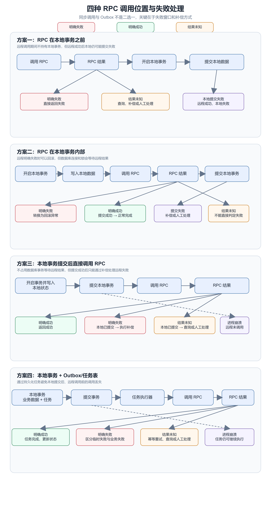

## 前言

在业务代码中，经常会看到这样的规则：

> 事务内部不应该进行 RPC 调用。

这条规则并没有错。事务内部调用一个不受本地系统控制的外部服务，会让数据库事务的生命周期依赖网络、远程服务和下游限流。一旦下游响应变慢，大量本地事务就可能长时间占用数据库连接、行锁和线程资源。

但如果业务是支付、退款、扣款这类资金操作，问题就没有这么简单：

- RPC 放在事务外，本地事务提交成功后，远程调用失败怎么办？
- RPC 放在事务前，远程调用成功后，本地事务失败怎么办？
- RPC 放在事务内，虽然不能获得跨系统原子性，但能否用人工补偿接受极少数异常？
- 如果为了彻底自动化而引入 Outbox、任务表、重试、对账，研发成本是否值得？

因此，真正需要讨论的不是“RPC 绝对不能放进事务”，而是：

> 在当前业务的并发量、同步体验、一致性要求和研发成本下，哪一种失败处理方式最合适？

本文以一个余额充值退款申请方法为例，讨论四种调用位置，并把内部 Feign/RPC 的分布式事务作为对比项。

## 一、先把问题边界说清楚

本文讨论的是一次性的同步 RPC 或 HTTP 调用。远程接口会在响应中返回本次调用的结果：

- 明确成功：远程接口确认本次操作成功；
- 明确失败：远程接口确认本次操作没有生效；
- 结果未知：请求可能已经发送，但客户端因为超时、连接断开或响应解析失败，无法判断远程是否生效。

“结果未知”是最重要的一类情况。

如果一个扣款请求已经发送到远程服务，客户端在读取响应时超时，那么这个异常只能说明“客户端没有拿到结果”，不能说明“远程服务没有执行”。HTTP 规范也不建议在无法确认原请求是否生效时，自动重试非幂等请求。[RFC 9110](https://www.rfc-editor.org/rfc/rfc9110.html)

余额充值退款还有一个特殊性：三方支付平台接口返回的成功首先表示“业务受理成功”，最终处理结果还依赖后续通知。这部分属于退款业务本身的异步流程，本文只把它当作案例背景，不将回调丢失和回调重复作为通用失败场景。

## 二、案例：退款方法为什么会产生这个问题

案例中的核心方法是：

~~~java
@Transactional(rollbackFor = Exception.class, timeout = 30)
public BctOrderRefundResponse applyBalanceRechargeRefund(
        RefundOrderDO refundOrder,
        OrderRefundDto orderRefundDto) {
    // 冻结用户余额
    userAccountService.lockBalance(...);

    // 修改充值返还相关的加盟商账户和分账数据
    fundFlowRecordService.addRechargeRefundFundFlowRecord(...);

    // 调用三方支付平台退款接口
    return paymentChannel.applyOrderRefund(orderRefundDto);
}
~~~

它的实际顺序是：

~~~text
开启本地事务
    ↓
冻结用户账户余额
    ↓
修改加盟商账户、分账明细和资金流水
    ↓
调用三方支付平台 HTTP 接口
    ↓
根据HTTP请求结果尝试提交或回滚本地事务
~~~

这段代码这样写有一个明显的业务收益：

- 当外部接口明确确认请求未生效，并且应用将该结果转换为符合回滚规则的异常时，本地冻结和加盟商账户修改可以随事务回滚；
- 当外部接口确认受理成功，并且本地事务最终提交成功时，资金冻结状态可以保持到退款最终完成；
- 代码结构直观，研发成本较低。

但要注意，外部接口返回业务失败、HTTP 客户端抛出异常和本地事务回滚，并不是同一件事。

> HTTP 客户端抛出异常，不等于远程一定没有执行成功。

连接建立失败可能意味着请求没有发出，但请求已经发送后出现读取超时、连接断开或响应解析失败时，只能说明客户端没有拿到可靠结果，不能说明远程操作一定没有发生。

另外，远程服务也可能通过正常 HTTP 响应返回业务错误码。正常返回一个错误响应对象，并不会自动触发 Spring 事务回滚；是否回滚取决于应用是否抛出符合回滚规则的异常，或者后续是否执行补偿。

## 三、四种 RPC 调用位置

### 3.1 事务前调用

执行顺序是：

~~~text
调用远程 RPC
    ↓
远程成功
    ↓
开启本地事务并写入数据库
~~~

优点是远程调用期间还没有持有本地数据库事务和行锁。如果远程明确失败，也不需要回滚本地数据库。

缺点是远程调用成功后，本地事务仍然可能失败：

~~~text
远程操作成功
    ↓
本地事务提交失败
    ↓
远程副作用已经存在，本地没有对应记录
~~~

因此，事务前调用只有在以下条件下才比较适合：

- 远程操作可以撤销；
- 远程操作具备幂等单号和状态查询能力；
- 本地失败后允许人工补偿；
- 或者远程调用本身只是一个无副作用的预检查。

如果远程操作是不可撤销的资金动作，并且调用前没有持久化业务意图，事务前调用通常是风险最高的方案。

尤其是在远程结果未知时，如果本地事先没有记录业务意图，后续不仅需要判断远程是否执行，还可能无法可靠关联这次远程请求对应的本地业务。

### 3.2 事务内调用

执行顺序是：

~~~text
开启本地事务
    ↓
写入本地数据库
    ↓
调用远程 RPC
    ↓
提交或回滚本地事务
~~~

它可以自动解决一个很常见的失败：

~~~text
远程明确失败
    ↓
抛出异常
    ↓
本地事务回滚
~~~

但它没有实现跨系统原子性：

~~~text
远程明确成功
    ↓
本地事务提交失败
    ↓
远程成功，本地失败
~~~

这时远程操作不会因为本地事务回滚而自动撤销。

事务内调用适合以下工程条件：

- QPS 较低；
- RPC 响应时间有明确上限；
- 本地事务较短，涉及的热点行较少；
- 业务需要同步返回明确的成功或失败；
- 远程请求具备唯一业务单号；
- 已经具备告警、查询和人工修复能力；
- 业务能够接受少量异常进入人工补偿。

这是一种“自动处理常规失败，人工处理极少数未知结果”的方案。它不是强一致，但可以是低成本、可运营的最终一致。

### 3.3 本地事务提交后直接调用

执行顺序是：

~~~text
开启本地事务
    ↓
写入本地状态
    ↓
提交本地事务
    ↓
调用远程 RPC
~~~

如果 RPC 返回明确成功，当前接口完全可以返回成功；如果 RPC 返回明确失败，也可以返回“远程失败，但本地状态已经提交”的具体结果。

它的主要问题不是无法同步返回结果，而是本地提交和远程调用之间存在空窗：

~~~text
本地事务提交成功
    ↓
进程在调用 RPC 前崩溃
    ↓
本地已经成功，远程没有执行
~~~

如果远程明确失败，本地事务已经无法回滚，需要执行补偿；只有补偿成功后，才能将本地业务完整标记为失败。如果补偿本身失败，则还需要进入待补偿状态。

因此，提交后直接调用适合：

- 远程调用丢失的后果可以接受；
- 本地状态可以安全地停留在“待处理”；
- 有其他机制发现和补发调用；
- 或者该操作的重要性不足以引入完整任务系统。

如果要求远程调用一定不能丢失，仅仅把代码放到事务提交后还不够。

### 3.4 本地事务加 Outbox 或任务表

执行顺序是：

~~~text
本地事务开始
    ↓
写入业务数据
写入 Outbox 任务
    ↓
本地事务提交
    ↓
任务执行器调用远程 RPC
~~~

它解决的是提交后直接调用的核心空窗：

~~~text
本地提交成功
    ↓
进程崩溃
    ↓
Outbox 任务仍然存在，后续可以继续执行
~~~

Outbox 解决的是“本地数据和待发送意图”的可靠落库，不会自动解决远程接口的幂等性和未知结果。任务执行器仍然需要处理：

- 重试；
- 幂等键；
- 远程明确失败；
- 发送后超时；
- 任务长期失败；
- 人工兜底。

Outbox 的研发成本也明显更高。一个原本只有退款业务和三方支付平台对接的系统，可能还需要增加任务表、任务状态、调度器、重试策略、并发控制、失败告警和管理入口。

所以 Outbox 是自动化程度更高的方案，不是所有业务场景的默认答案。

## 四、四种调用位置的主流程

下面这张图把四种调用位置拆成独立流程。每个流程都明确展示了本地事务、RPC 和失败出口之间的关系。

这张图中，结果未知不是第五种调用方案，而是每种方案都必须面对的一类远程结果。

## 五、什么时候可以把 RPC 放进事务内

“事务内不能 RPC”更适合作为默认风险提示，而不是绝对规范。

在以下场景中，事务内调用可以是合理的：

### 1. 业务要求同步完成

调用方必须在本次请求中知道远程操作成功还是失败，不能接受“已受理”或“稍后处理”。

例如管理后台发起一笔低频退款申请，操作员需要在当前页面马上知道三方支付平台是否接受了请求。

### 2. 并发和资源压力可控

事务内调用适合并发量较低、数据库连接池和热点行锁压力可控的场景。

“低 QPS”不能单独作为判断依据，还需要估算并发请求数、外部接口最大耗时、数据库连接池容量以及事务中涉及的热点数据。如果下游故障期间可能同时积压大量请求，即使平均 QPS 较低，也可能形成长事务和锁竞争。

### 3. RPC 延迟有硬上限

事务内调用必须有明确的连接超时、读取超时和整体超时。否则数据库事务的最长持续时间就可能接近网络故障的最长持续时间。

这个超时上限必须来自 HTTP 客户端的明确配置，不能把客户端默认行为当作可靠的硬上限。

### 4. 可以人工补偿

人工补偿不能只是打印一条错误日志，而至少需要：

- 持久化业务单；
- 记录请求参数和业务单号；
- 记录异常分类；
- 发送告警；
- 提供远程状态查询或人工处理入口；
- 规定处理时限和责任人。

只有这样，“人工补偿”才是一种可运营的架构选择，而不是把风险隐藏起来。

### 5. 本地事务写入较少

如果在 RPC 之前已经修改了大量热点数据，事务内调用的锁风险会明显增大。尤其是账户余额、库存、商户账户等高竞争资源，不应无条件延长锁持有时间。

## 六、什么时候不应该放进事务内

以下情况更适合考虑缩短本地事务，但具体选择提交后直接调用、领域任务表还是 Outbox，还要结合远程接口能力判断：

- 下游接口延迟不可控；
- 下游经常限流或出现故障；
- 调用 QPS 高，且本地写入涉及热点行；
- 业务不能接受人工补偿；
- 远程成功但本地提交失败时，损失不可接受；
- 进程崩溃后不能允许远程调用丢失。

如果外部请求既无法幂等、无法查询，也没有撤销接口，那么 Outbox 只能保证本地任务意图不丢失，不能保证远程操作可以安全重试。此时应优先改造远程接口协议，或者明确保留人工核查和补偿边界。

## 七、Outbox、事件和异步任务的边界

Spring 的事务事件可以绑定到事务提交阶段，例如使用 @TransactionalEventListener 的 AFTER_COMMIT 阶段。[Spring 事务事件文档](https://docs.spring.io/spring-framework/reference/7.1/data-access/transaction/event.html)

但事务提交后的进程崩溃，仍然可能导致事件监听器没有执行。因此，进程内事件不等于可靠任务。

Outbox 的思路是把业务数据和待发送意图写入同一个本地事务。事务提交后，再由独立的任务执行器将意图发送到消息系统或远程服务。这样可以避免“数据库已经提交，但发送任务丢失”的双写问题。[AWS Transactional Outbox](https://docs.aws.amazon.com/en_en/prescriptive-guidance/latest/cloud-design-patterns/transactional-outbox.html)

但是 Outbox 也不是免费的：

- 需要任务状态；
- 需要调度和抢占；
- 需要重试和退避；
- 需要处理重复执行；
- 需要处理永久失败；
- 需要建设告警和人工兜底。

如果业务 QPS 很低，也可以先使用领域内已有的业务单表承担任务记录，而不一定马上建设通用 Outbox 框架。关键是任务必须持久化，并且能够被再次发现和处理。

## 八、内部 Feign/RPC 与分布式事务

Feign 只是内部服务之间的通信方式，本身不提供分布式事务。

如果内部服务都接入了同一个事务协调器，情况就不同了：

- Seata AT 主要通过数据源代理和回滚日志，处理多个数据库参与者的事务；
- Seata TCC 要求业务实现 Try、Confirm、Cancel；
- Seata Saga 允许每个服务先提交本地事务，失败时执行补偿逻辑。

Seata AT 需要参与者使用受支持的数据库访问方式和数据源代理；TCC 则需要业务服务显式实现两阶段操作。[Seata AT](https://seata.apache.org/docs/user/mode/at/)、[Seata TCC](https://seata.apache.org/docs/v1.5/user/mode/tcc/)、[Seata Saga](https://seata.apache.org/docs/dev/mode/saga-mode/)

因此，内部 Feign 调用和第三方 HTTP 调用不能混为一谈：

例如：

~~~text
订单服务
    └── 在 Seata 全局事务中 Feign 调用支付服务
            ├── 修改支付服务数据库
            └── 调用第三方支付平台 HTTP 接口
~~~

如果订单服务和支付服务都正确接入同一个事务协调器，Seata 可以协调两个服务的数据库操作。但第三方支付平台 HTTP 接口没有作为事务参与者接入 Seata，因此订单服务或支付服务的事务回滚，都不能自动撤销第三方支付平台已经产生的副作用。

所以，Feign 只是服务间的通信方式；能否纳入分布式事务，取决于远程服务是否作为事务参与者接入协调器。远程服务内部调用的第三方 HTTP，则仍需独立处理幂等、查询、补偿或人工核查。

## 九、回到余额充值退款案例

当前退款代码属于“事务内同步调用”方案：

~~~text
冻结用户余额
    ↓
修改加盟商账户和分账数据
    ↓
调用三方支付平台
    ↓
提交或回滚本地事务
~~~

这种结构并非天然错误。对于低 QPS、强同步体验，并且已经接受人工补偿的后台退款操作，它可以是一个研发成本较低的方案。

但当前代码需要修正一个关键的异常假设：

~~~text
RPC 抛异常 ≠ 远程一定没有执行
~~~

至少应该把结果分成三类：

~~~text
明确失败：确认远程操作未生效
    → 本地事务尚未提交：将结果转换为回滚异常
    → 本地事务已经提交：执行解冻或冲正补偿

明确成功：确认远程操作已经生效
    → 提交本地事务，继续后续业务流程

结果未知：无法判断远程是否生效
    → 不能直接标记退款失败
    → 保留待确认状态，进入查询或人工处理
~~~

对这个具体退款案例，还需要注意三方支付平台的“成功”可能只是受理成功，最终业务结果并不是同步 RPC 响应本身。这是退款业务特有的后续状态机，不应直接套用到所有普通 RPC 调用。

## 十、最终结论

RPC 是否放入事务，没有脱离业务约束的绝对答案。

首先，同步返回远程结果与 RPC 的调用位置是两个维度。即使要求同步返回，也可以选择事务前调用、事务内调用或本地事务提交后直接调用；它们的差异在于锁持有时间、失败窗口和补偿方式，而不是能否同步返回。

其次，允许异步也不代表必须使用 Outbox。远程调用丢失可以接受时，可以采用提交后直接调用或进程内事件；只有当远程调用不能丢失，并且可靠投递、重试和运维自动化的收益能够覆盖研发成本时，才值得建设领域任务表或通用 Outbox。

对于本文的退款案例，低 QPS、强同步体验且允许人工补偿时，事务内调用可以是合理的低成本方案，但必须区分明确失败、明确成功和结果未知，不能把所有 RPC 异常都当作退款失败。随着并发量、外部接口不稳定性或人工处理成本上升，再演进为任务表或 Outbox。

如果是内部服务之间的 Feign/RPC 调用，并且各服务都接入同一事务协调器，可以使用 Seata AT、TCC 或 Saga；但第三方 HTTP 不属于该分布式事务边界，仍需独立处理幂等、查询和补偿。

因此，RPC 调用位置最终取决于四个因素：

1. 是否要求同步返回远程结果；
2. 结果未知时是否允许人工补偿；
3. 远程调用丢失或重复的业务代价；
4. 自动化机制的研发和运维成本。

一句话总结：

> 事务内 RPC 不是绝对错误，Outbox 也不是异步业务的必选项；真正需要权衡的是一致性目标、资源压力、补偿能力和研发成本。

## 参考资料

- [RFC 9110：HTTP Semantics](https://www.rfc-editor.org/rfc/rfc9110.html)
- [Spring Framework：Transaction-bound Events](https://docs.spring.io/spring-framework/reference/7.1/data-access/transaction/event.html)
- [AWS：Transactional outbox pattern](https://docs.aws.amazon.com/en_en/prescriptive-guidance/latest/cloud-design-patterns/transactional-outbox.html)
- [Apache Seata：AT Mode](https://seata.apache.org/docs/user/mode/at/)
- [Apache Seata：TCC Mode](https://seata.apache.org/docs/v1.5/user/mode/tcc/)
- [Apache Seata：Saga Mode](https://seata.apache.org/docs/dev/mode/saga-mode/)
